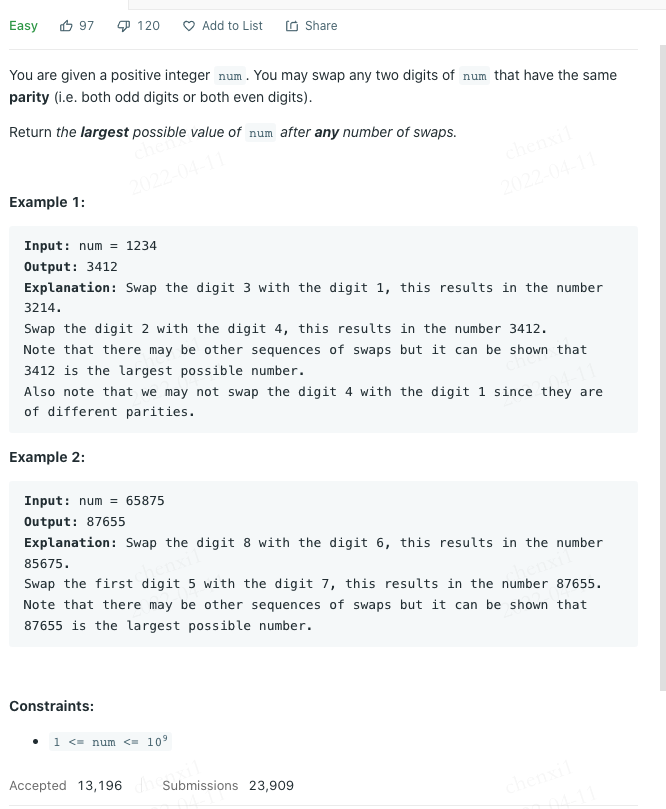

# 2231. Largest Number After Digit Swaps by Parity

## 

    
    
##  
    - tag_easy

## 
    The bigger digit should appear first (more to the left) because it contributes more to the value of the number.
    Get all the even digits, as well as odd digits. Sort them separately.
    Reconstruct the number by giving the earlier digits the highest available digit of the same parity.

